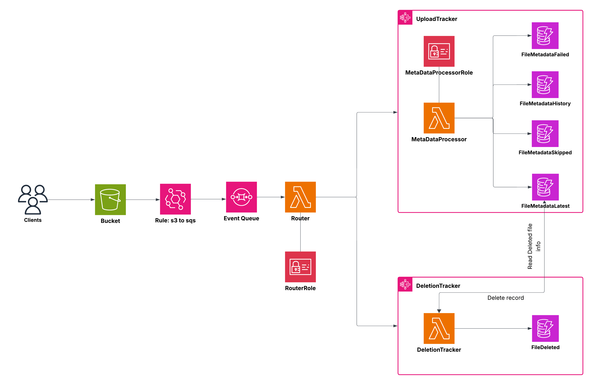

# 📁 FileInsights

---

## Overview

**FileInsights** is a cloud-native, event-driven metadata tracking system for file operations on AWS. It captures and manages metadata for file uploads and deletions in real-time, providing full traceability, analytics, and operational insight across a file's lifecycle.

This system leverages **AWS S3**, **EventBridge**, **SQS**, **Lambda**, **StepFunctions**, **DynamoDB** to process, categorize, and store file metadata with high precision and scalability.

Note: This will be scaledup in the future to process and store more insights

---

## 🧩 Key Features

- 🔁 Event-driven architecture using AWS-native components
- 📊 Metadata routed into multiple categorized tables:
  - `FileMetadataLatest`: current view
  - `FileMetadataHistory`: full audit trail
  - `FileMetadataSkipped`: filtered/bypassed files
  - `FileMetadataFailed`: processing errors
  - `FileDeleted`: log of removed files
- 🧠 Smart routing function separates upload and deletion flows
- 🔐 Fine-grained IAM roles (`RouterRole`, `MetaDataProcessorRole`)
- ☁️ 100% serverless design

---

## 🧬 Architecture

**How it works:**
1. Clients upload or delete files in an **S3 bucket**.
2. **S3 triggers Event Bridge Rule** to write to an **SQS** which are consumed by the **Router Lambda**.
3. The router forwards events to the following stepfunctions:
   - **UploadTracker** → handled by `MetaDataProcessor` Lambda
   - **DeletionTracker** → handled by `DeletionTracker` Lambda
4. Metadata is processed and stored in DynamoDB tables based on outcome (latest, history, deleted, etc.).

---

## 🚀 Use Cases

- 🔍 Metadata auditing for compliance and governance
- 📈 File event analytics over time
- ✅ Verifying and validating file operations
- 🔐 Traceable deletion records (e.g., for GDPR)

---

## ⚙️ Setup

- To be updated

